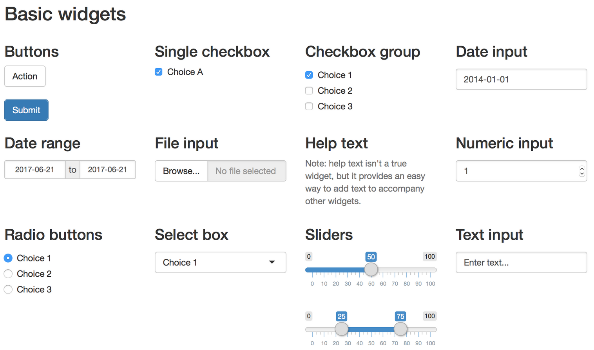
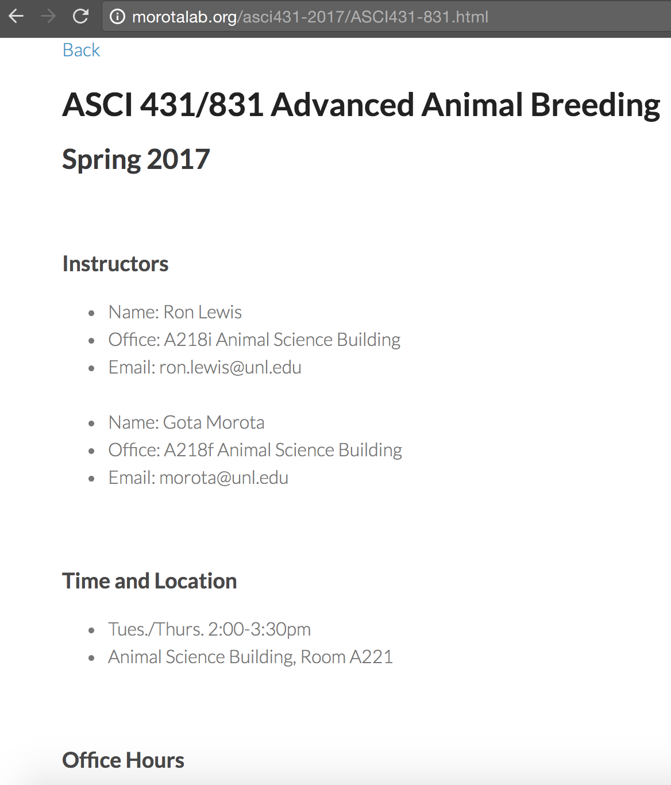
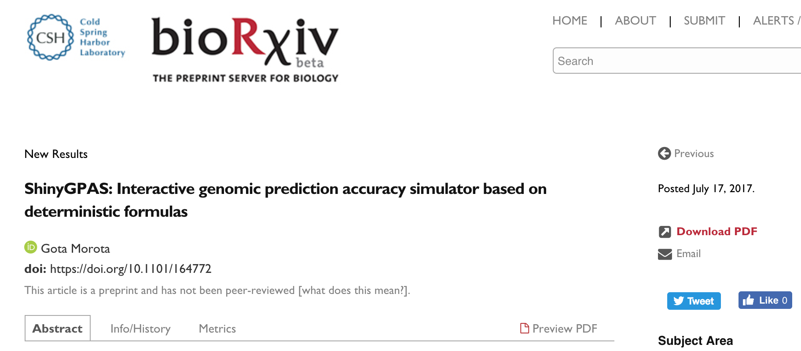

```{r setup, include=FALSE}
options(htmltools.dir.version = FALSE)
```


# Shiny - [https://shiny.rstudio.com/](https://shiny.rstudio.com/)

- A web application framework for **interactive** visualization

- Able to generate user friendly web interfaces 

- Built on a reactive programming model

- Entirely extensible 
   - custom inputs and outputs
   - CSS themes
   - JavaScript and D3.js

- Example - [Collision Detection](https://bl.ocks.org/mbostock/raw/3231298/)

---

# Shiny framework 


**Template**
```{r eval=FALSE, tidy=FALSE}
library(shiny)

ui <- fluidPage()
server <- function(input, output) {}

shinyApp(ui = ui, server = server)
```


---

# Control widgets 

.center[[RStudio](https://shiny.rstudio.com/tutorial/written-tutorial/lesson3/)]


---

# Spring 2017 - ASCI 431 / 831
My first time teaching undergraduate students.  




---

# Deterministic formulas (1)

- Daetwyler et al. (2008; 2010)
\begin{align}
r &= \sqrt{\frac{N h^2}{N h^2 + M_e} }
\end{align}

- Goddard 2009
\begin{align}
r &= \sqrt{1 - \frac{\lambda}{2N\sqrt{\alpha}} \ln\left( \frac{1 + \alpha + 2\sqrt{\alpha}}{1 + \alpha - 2\sqrt{\alpha}}\right) }
\end{align}
where $\lambda$ is $M_e/(h^2\ln(2N_e))$ and $\alpha$ is $1 + 2(M_e/Nh^2\ln(2N_e))$

-  Goddard et al. 2011
\begin{align}
r &= \sqrt{b \frac{Nbh^2/M_e}{1 + Nbh^2/M_e}}
\end{align}
where $b = M/(M + M_e)$


---

# Deterministic formulas (2)

- de los Campos et al. (2013)
\begin{align}
r &= \sqrt{ [1 - (1 - b)^2] h^2 }
\end{align}

- Karaman et al. (2016)
\begin{align}
r &=  \sqrt{ h^2_M \left[ \frac{N h^2_M}{N h^2_M + M_e}  \right] }
\end{align}


---

# Deterministic formulas (3)

- Wientjes et al. (2016)
\begin{align}
r = \sqrt{ \begin{bmatrix} b_{AC} r_{G_{AC}} \sqrt{\frac{h^2_A}{M_{e_{A,C}}}  } & b_{BC} r_{G_{BC}} \sqrt{\frac{h^2_B}{M_{e_{B,C}}}} \end{bmatrix} \begin{bmatrix} \frac{h^2_A}{M_{e_{A,C}}} + \frac{1}{N_A} & r_{G_{AB}} \sqrt{\frac{h^2_A h^2_B}{M_{e_{A,C}} M_{e_{B,C}} }   } \\ r_{G_{AB}} \sqrt{\frac{h^2_A h^2_B}{M_{e_{A,C}} M_{e_{B,C}} }   } &  \frac{h^2_B}{M_{e_{B,C}}} + \frac{1}{N_B} \end{bmatrix}^{-1} } \\
\times \sqrt{\begin{bmatrix} b_{AC} r_{G_{AC}} \sqrt{\frac{h^2_A}{M_{e_{A,C}}}} \\ b_{BC} r_{G_{BC}} \sqrt{\frac{h^2_B}{M_{e_{B,C}}}} \end{bmatrix}}
\end{align}


Combines two populations A and B to predict prediction accuracy in population C.


---

class: inverse, center, middle

# Demonstration of ShinyGPAS

[https://chikudaisei.shinyapps.io/shinygpas/](https://chikudaisei.shinyapps.io/shinygpas/)


---

# Preprint



---
class: inverse, left, middle

# ShinyGPAS - Shiny Genomic Prediction Accuracy Simulator

Can be used for 
- _interactive_ exploration of potential factors influencing prediction accuracy 

- simulation of achievable prediction accuracy 
   - prior to genotyping individuals or performing CV
   
- supporting in-class teaching

- no knowlege of R, HTML, JavaScript, or CSS is required. R code encapsulated as a web-based Shiny application


Available at [https://chikudaisei.shinyapps.io/shinygpas/](https://chikudaisei.shinyapps.io/shinygpas/) and [https://github.com/morota/ShinyGPAS](https://github.com/morota/ShinyGPAS)


